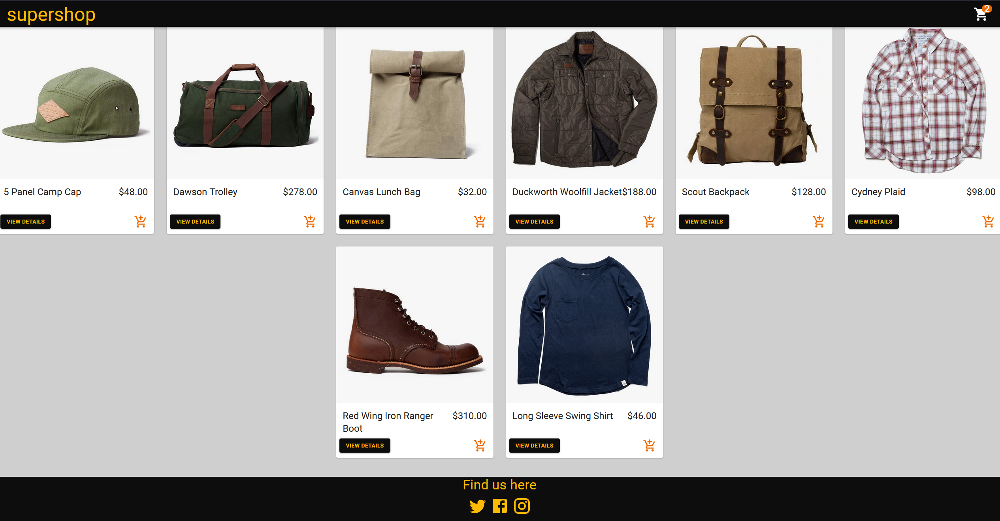
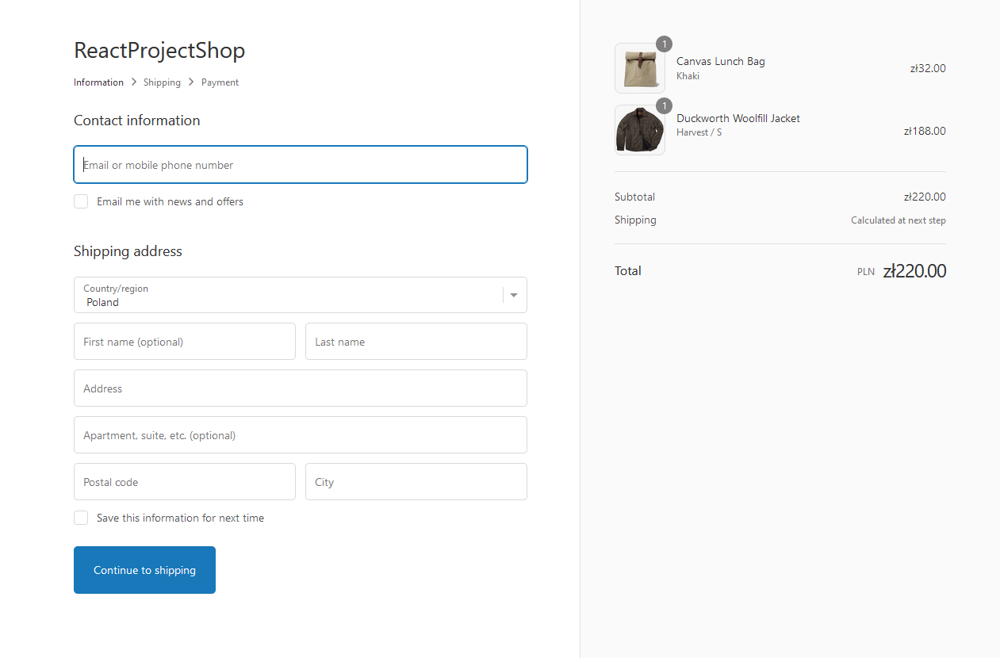
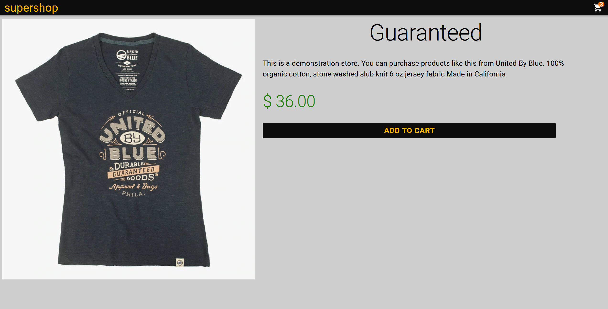

# SuperShop

## Table of contents

- [Overview](#overview)
- [Installation](#installation)
- [Features](#features)
- [Screenshots](#screenshots)
- [Technologies](#technologies)

## Overview

This project is a modern and responsive e-commerce web application built using React and Shopify. It provides a user-friendly interface for browsing products, adding them to the cart, and completing the purchase process.

## Installation

Navigate to the project directory:

```bash
  cd  SuperShop
```

Install dependencies using npm:

```bash
  npm install
```

Start the development server:

```bash
  npm start
```

Open your browser and visit http://localhost:3000 to view the application.

## Features

- **Product Catalog:** Browse through a catalog of products with detailed information.
- **Shopping Cart:** Add products to the cart and review the items before checkout.
- **Checkout Process:** Complete the purchase with a smooth and intuitive checkout process.
- **Responsive Design:** Enjoy a seamless experience on various devices - desktop, tablet, and mobile.

## Screenshots

<br>
<br>
<br>
<br>

## Technologies

- React.js
- Material UI
- JavaScript
- React Router
- [Shopify SDK](https://shopify.dev/docs/custom-storefronts/additional-sdks)
- HTML5
- CSS3
